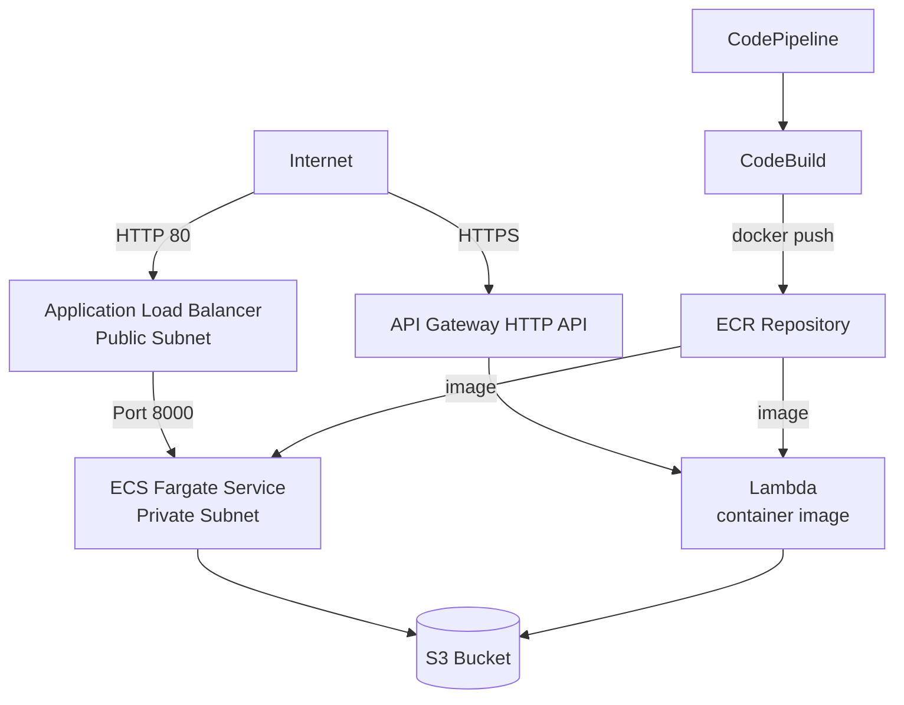

# Stratocore - Golden Path: Python API on AWS

Golden Path for deploying a FastAPI application on AWS using two compute strategies: containerized (ECS Fargate) and serverless (Lambda). Infrastructure defined as code with AWS CDK TypeScript. CI/CD via CodePipeline + CodeBuild.

---

## Architecture



### Resources

| Resource | Description |
|---|---|
| VPC | 2 AZs, public + private subnets, 1 NAT Gateway |
| S3 Bucket | Persistent file storage |
| ECR Repository | Docker image registry (`stratocore-api`) |
| ECS Cluster + Fargate | Containerized API, private subnets |
| ALB | Public HTTP entrypoint for ECS (port 80) |
| Lambda (container) | Serverless API using same Docker image |
| API Gateway HTTP API | Public entrypoint for Lambda |
| CodePipeline + CodeBuild | CI/CD pipeline triggered by GitHub push |

---

## Design Decisions

### Why Two Compute Strategies?

ECS Fargate handles long-running workloads with persistent connections. Lambda handles stateless, event-driven workloads with automatic scale-to-zero. Both use the same Docker image - a single CI/CD build serves both compute targets, keeping the pipeline simple.

### Why API Gateway HTTP API (not REST API)?

HTTP API is the newer generation: 70% cheaper and sufficient for proxying requests to Lambda. REST API adds features (caching, API keys, usage plans) not required here.

### Storage: Why S3?

Local container storage is ephemeral - files are lost on container restart or redeployment. S3 provides durable, persistent object storage that survives container lifecycle events. The bucket name is injected as an environment variable (`BUCKET_NAME`) so the same code works in any environment.

### IAM Permissions

Least privilege principle applied throughout:
- **ECS task role**: `s3:GetObject`, `s3:PutObject`, `s3:DeleteObject`, `s3:ListBucket` on the project bucket only (via `bucket.grantReadWrite`)
- **Lambda execution role**: same S3 permissions, scoped to project bucket only
- No wildcard `s3:*` or `Resource: "*"` permissions

### Serverless Approach: Alternatives Explored

| Option | Description | Verdict |
|---|---|---|
| **Lambda + API Gateway HTTP API + Mangum** | Mangum translates API Gateway events to ASGI. Same FastAPI code, no modifications. | ✅ **Chosen** - standard, well-documented, FastAPI-native |
| Lambda Web Adapter (LWA) | Runs uvicorn inside Lambda using a custom runtime extension | ❌ Less transparent, more complex to debug |
| Lambda + Function URL | Direct Lambda invocation without API Gateway | ❌ No throttling, no custom auth, fewer routing features |

**Why Mangum?** FastAPI is an ASGI framework. Lambda expects a synchronous `handler(event, context)` function. Mangum acts as an adapter between the two without requiring any changes to the FastAPI code:

```python
from mangum import Mangum
handler = Mangum(app)  # used by Lambda
# uvicorn.run() used by ECS
```

**Why container image Lambda instead of zip?** A zip package would require a separate build step: packaging dependencies, managing layer size limits (250MB unzipped), and maintaining a separate artifact from ECS. With a container image, the same Docker image built for ECS is reused for Lambda - Lambda simply overrides the CMD to `main.handler`. One build, one artifact, no size limit issues (up to 10GB), unified CI/CD pipeline.

### Networking

- ECS Fargate runs in **private subnets** - not reachable from the internet
- Traffic flows: `Internet → ALB (public) → ECS (private)`
- Security Groups enforce this strictly: ECS SG only accepts traffic from the ALB SG
- NAT Gateway (1 AZ) allows ECS in private subnets to pull images from ECR

### Production Improvements

What would be added in a production environment:
- **HTTPS on ALB** via ACM certificate + custom domain
- **WAF** (Web Application Firewall) in front of ALB and API Gateway to block SQL injection, XSS, and DDoS
- **VPC Endpoints** for ECR to avoid ECR traffic going through the NAT Gateway
- **CodeBuild IAM role** scoped to `iam:PassRole` only instead of `IAMFullAccess`

---

## API Endpoints

| Method | Path | Description |
|---|---|---|
| GET | `/health` | Health check → `{"status": "healthy"}` |
| POST | `/upload` | Upload a file to S3 |
| GET | `/files` | List all uploaded files |
| DELETE | `/files/{filename}` | Delete a specific file |

---

## Runbook: Deploy from Scratch

### Prerequisites

- AWS CLI configured (`aws configure`)
- Node.js 18+ and npm
- Docker
- Python 3.12

### 1. Clone the repo

```bash
git clone <repo-url>
cd stratocore-golden-path
```

### 2. Bootstrap CDK (first time only)

```bash
cd infra
npm install
npx cdk bootstrap aws://<ACCOUNT_ID>/us-east-1
```

### 3. Deploy CDK stack

```bash
cd infra
npx cdk deploy StratocoreStack
```

Outputs will show:
- `AlbUrl` - ECS Fargate endpoint
- `ApiGatewayUrl` - Lambda endpoint
- `BucketName` - S3 bucket name
- `EcrRepo` - ECR repository URI

### 4. First-time image push to ECR

CDK creates the ECR repository in step 3. Push the Docker image so ECS and Lambda can start:

```bash
aws ecr get-login-password --region us-east-1 | docker login --username AWS --password-stdin <ACCOUNT_ID>.dkr.ecr.us-east-1.amazonaws.com

docker build -t stratocore-api app/
docker tag stratocore-api:latest <EcrRepo_output>:latest
docker push <EcrRepo_output>:latest
```

After this push, ECS will start the service (~2-3 min). From this point, CI/CD handles all subsequent image builds and deploys automatically on every push to `main`.

### 5. Set up CI/CD (CodePipeline)

In the AWS Console:
1. Go to **CodePipeline → Create pipeline**
2. Source: **GitHub (via CodeStar connection)**
3. Build: **CodeBuild** using the `buildspec.yml` at the root of the repo
4. Ensure the CodeBuild IAM role has permissions: `ecr:*`, `ecs:*`, `lambda:*`, `cloudformation:*`, `iam:PassRole`

### 6. Test the endpoints

```bash
# Health check (ECS)
curl http://<ALB_URL>/health

# Health check (Lambda)
curl https://<API_GATEWAY_URL>/health

# Upload a file
curl -X POST http://<ALB_URL>/upload -F "file=@/path/to/file.txt"

# List files
curl http://<ALB_URL>/files

# Delete a file
curl -X DELETE http://<ALB_URL>/files/file.txt
```

---

## Repository Structure

```
stratocore-golden-path/
├── app/
│   ├── main.py          # FastAPI app + Mangum handler
│   ├── requirements.txt
│   └── Dockerfile
├── infra/
│   ├── bin/app.ts       # CDK entrypoint
│   ├── lib/stratocore-stack.ts  # All infrastructure
│   ├── package.json
│   ├── tsconfig.json
│   └── cdk.json
├── buildspec.yml        # CodeBuild CI/CD
└── README.md
```
